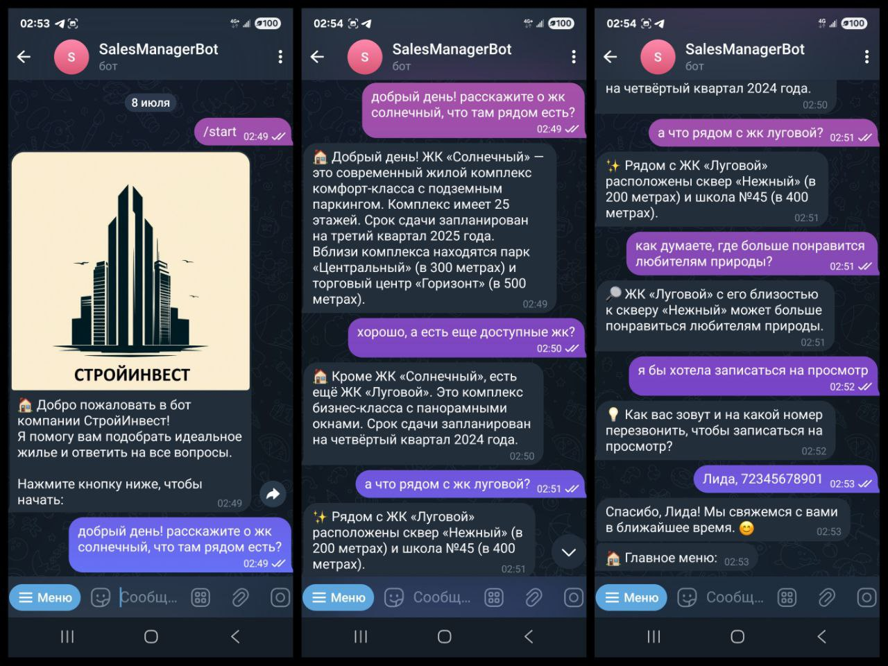
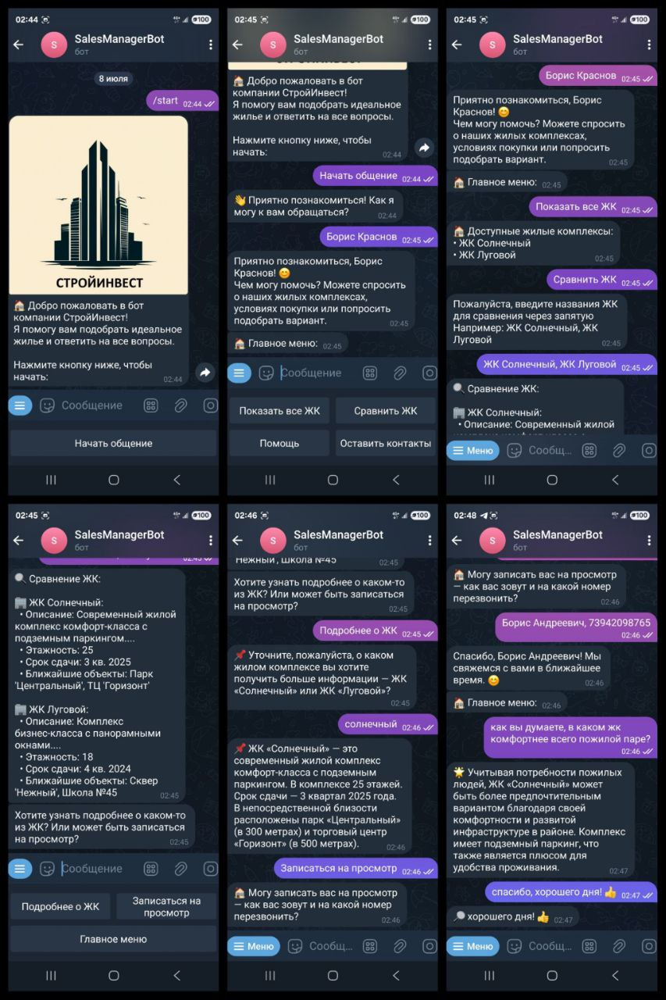
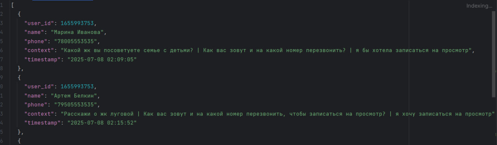

# 🏠 RealEstateManagerBot - Ассистент по недвижимости

Телеграм-бот для компании по недвижимости, помогающий клиентам подобрать жильё и собирающий контактные данные для дальнейшего взаимодействия с помощью YandexGPT.

## 🔍 Краткий анализ LLM API
*(На основе [Russian LLM Benchmarks](https://github.com/kuk/rulm-sbs2), [Habr: Сравнение нейросетей](https://habr.com/ru/articles/856436/), [YandexGPT vs ChatGPT](https://aicompetence.org/yandexgpt-vs-chatgpt/))*

### Сравнение трёх популярных LLM:
1. **OpenAI GPT-3.5** 🧠  
   - Генерация русского текста с "переводным стилем"  (https://habr.com/ru/articles/856436/)
   - Плохо поддерживает контекст диалога  
   - Слабое понимание российских бизнес-реалий  

2. **YandexGPT** 🟧✨  
   -  обогнал GigaChat по результатам RussianSuperGlue (https://github.com/kuk/rulm-sbs2)
   - Специально обучен на русскоязычных материалах  
   - Простая интеграция через Yandex Cloud API  

3. **GigaChat** 🤖  
   - Слабые результаты в диалогах и резюмировании (https://habr.com/ru/articles/856436/)  
   - Ограниченная доступность API  
   - Частые "галлюцинации" без предупреждений  

### 🏆 Почему выбран YandexGPT:
- **🎯 Лучшее качество русского языка** - естественные, грамматически правильные ответы  
- **🇷🇺 Понимание российских реалий** - культурный контекст, терминология недвижимости  
- **⚡ Простая интеграция** - готовый SDK и подробная документация  
- **💸 Бесплатный квоты** - идеально для прототипирования  
- **🔒 Безопасность данных** - обработка в РФ (соответствие 152-ФЗ)  

## ✨ Особенности бота
- 🔍 Поиск объектов недвижимости в базе данных  
- 📊 Сравнение жилых комплексов по параметрам  
- 💬 Естественное общение через YandexGPT  
- 📝 Сбор контактных данных с плавным переходом  
- 🧭 Удобное меню и навигация  

## ⚙️ Технологии
- Python 3.10+  
- `python-telegram-bot` 20.3+  
- YandexGPT API  
- JSON для хранения данных  

## 🚀 Установка и запуск

1. Клонируйте репозиторий:
```bash
git clone https://github.com/ElNathalis/RealEstateManagerBot.git
cd RealEstateManagerBot
```
Установите зависимости:

```bash
pip install -r requirements.txt
```
Настройте окружение:

```bash
cp .env.example .env
```
Заполните .env файл:

```ini
TELEGRAM_TOKEN=ваш_токен_бота
YANDEX_API_KEY=ваш_api_ключ
FOLDER_ID=идентификатор_каталога
```
Запустите бота:

```bash
python bot.py
```
## 🎮 Примеры команд
/start - Начать диалог

/help - Получить справку

/menu - Показать главное меню

/reset - Сбросить состояние диалога

## 💬 Примеры диалогов

1. поддержание неформальной беседы и сбор контактов


2. использование навигации бота и сравнение с условием (какой жк по мнению бота лучше для молодой семьи)


3. вывод списка жк, их сравнение, мнение о том, какой лучше подходит для пожилой пары, сбор контактов



## 🗃️ Структура базы данных

Данные хранятся в data/database.json в формате:

```json
{
  "ЖК Солнечный": {
    "описание": "Современный жилой комплекс комфорт-класса...",
    "этажность": 25,
    "срок_сдачи": "3 кв. 2025",
    "соседи": ["Парк Центральный", "ТЦ Горизонт"]
  }
}
```

Сохраненные контакты хранятся в data/contacts.json в формате:


## 📮 Поддержка
По вопросам работы бота обращайтесь в [телеграм](https://t.me/abobaobabuss)
